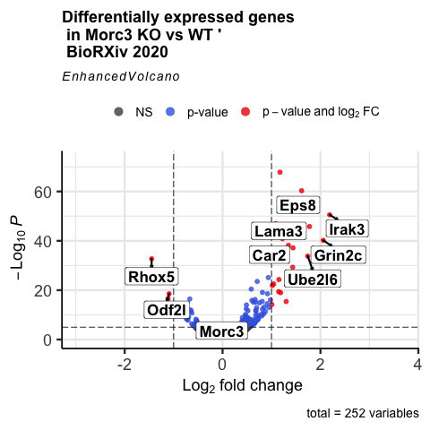
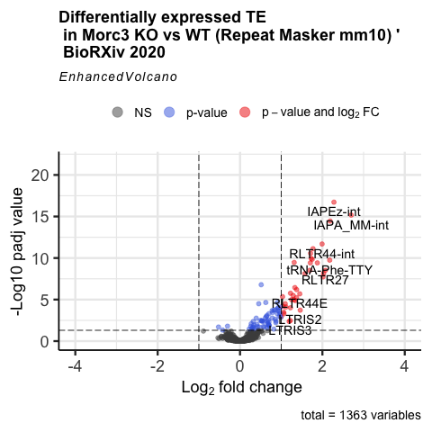

## Introduction

The goal of this notebook is to generate the volcano plot for the Morc3 RNA-seq data published on bioRxiv the 14-11-2020.

```{r libraries, include=FALSE}

library(dplyr)
library(readxl)
library(EnhancedVolcano)
library(kableExtra)
```

## Import the tables.

I import the tables with in the following variables:

```{r import tables, echo=TRUE}

genes <- read_excel("data/RNA_genes.xlsx")
TE    <- read_excel("data/RNA_TE.xlsx")
```

```{r}
head(genes)
```

## Volcano plot genes

This is the volcano plot with the genes

```{r Volcano genes}
Volcano_genes <-EnhancedVolcano(genes,
    lab = genes$`Gene Name`,
    x = 'log2FoldChange',
    y = 'padj',
    xlim = c(-4, 4),
    pCutoff = 0.05,
    ylab= "-Log10 padj value",
    title="Differentially expressed genes \n in Morc3 KO vs WT '\n BioRXiv 2020")
Volcano_genes
```

```{r Volcano genes with labels}

Volcano_genes_labels <- EnhancedVolcano(genes,
    lab = genes$`Gene Name`,
    x = 'log2FoldChange',
    y = 'pvalue',
    title="Differentially expressed genes \n in Morc3 KO vs WT '\n BioRXiv 2020",
    selectLab = c('Irak3', 'Grin2c', 'Lama3', 'Ube2l6', 'Eps8', 'Car2', 'Morc3', 'Rhox5', 'Odf2l'),
    xlab = bquote(~Log[2]~ 'fold change'),
    pCutoff = 10e-6,
    FCcutoff = 1.0,
    pointSize = 2.0,
    labSize = 6.0,
    labCol = 'black',
    labFace = 'bold',
    boxedLabels = TRUE,
    colAlpha = 4/5,
    legendLabSize = 14,
    legendIconSize = 4.0,
    drawConnectors = TRUE,
    widthConnectors = 1.0,
    colConnectors = 'black',
    )

Volcano_genes_labels
```

```{r include=FALSE}
pdf(file = "output/Volcano_plot_Morc3_bioRxiv_RNAseq_genes.pdf")
Volcano_genes
Volcano_genes_labels
dev.off()
```

```{r save unlabel png, include=FALSE}
png(filename = "output/Volcano_plot_Morc3_bioRxiv_RNAseq_genes.png")
Volcano_genes
dev.off()
```


```{r save label png, include=FALSE}
png(filename = "output/Volcano_plot_Morc3_bioRxiv_RNAseq_genes_label.png")
Volcano_genes_labels
dev.off()

```



There are 165 upregulated genes and 89 downregulated genes (pdaj \< 0.05). \#\# Volcano plot TE

```{r TE volcano}

TE$padj <- as.numeric(TE$padj)
Volcano_TE <-EnhancedVolcano(TE,
    lab = TE$repeatName,
    x = 'log2FoldChange',
    y = 'padj',
    xlim = c(-4, 4),
    pCutoff = 0.05,
    ylab= "-Log10 padj value",
    title="Differentially expressed TE \n in Morc3 KO vs WT (Repeat Masker mm10) '\n BioRXiv 2020")
Volcano_TE
```

```{r save pdf TE volcano, include=FALSE}
pdf(file = "output/Volcano_plot_Morc3_bioRxiv_RNAseq_TE.pdf")
Volcano_TE
dev.off()
```

```{r save png TE volcano, include=FALSE}
png(file = "output/Volcano_plot_Morc3_bioRxiv_RNAseq_TE.png")
Volcano_TE
dev.off()
```



38 TE have a log2FC \> 1.

```{r TE filter}
TE_FC1 <- TE %>%
  filter(log2FoldChange >= 1)
```

```{r kable, echo=FALSE}
table <- TE_FC1 %>%
  kbl() %>%
  kable_paper("hover", full_width = F)

table
```
